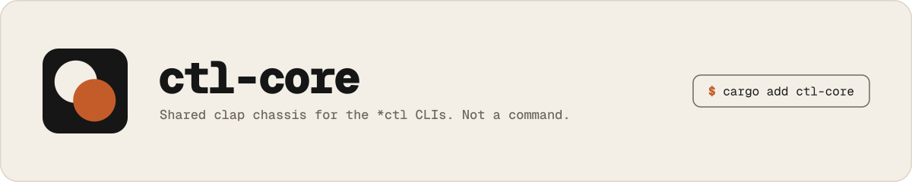

# ctl-core

<picture>
  <source media="(prefers-color-scheme: dark)" srcset="docs/banner-dark.svg">
  
</picture>

Shared clap chassis for the `*ctl` CLIs (`forkctl`, `qctl`, `verctl`)
and `state-sync`. Not a command. Import it as `ctl_core`.

Cargo features are the Rust equivalent of tree-shaking: a consumer that
only needs the enums does not compile `clap` or `comfy-table`.

```toml
ctl-core = { version = "0.0.1", default-features = false, features = ["json"] }
```

Models (`Envelope`, `ColorMode`, `OutputFormat`) come first. `View`
picks pretty, JSON, or colorless. Pretty may contain ANSI; JSON never
does. Prepare the data; `Pretty` + a Jinja template (`View::show_pretty`)
owns loops and ``. Command output uses `kv` / `grid` tables
with styled tokens, not space-padded labels. `formatdoc` stays for
one-liners.

Domain verbs stay in each CLI. This crate owns:

- `-h` / `--help` and `-V` / `--version` (never `disable_help_flag`)
- short **and** long forms on shared flags
- `--foo` / `--no-foo` negations (`--no-color` wins over `--color`)
- `-c` / `--color` `auto|always|never` (or `--color` only when `-c` is taken)
- `-f` / `--format` `pretty|json`
- `-n` / `--dry-run` / `--preview`
- `-q` / `--quiet`
- styled help (same table as forkctl / state-sync)
- `{bin}: {error:#}` plus a JSON error object

## Use

```rust,ignore
use ctl_core::prelude::*;

#[derive(Parser)]
#[command(version, about = "example", arg_required_else_help = true)]
struct Cli {
    #[command(flatten)]
    output: OutputArgs,
    #[command(subcommand)]
    command: Command,
}

#[derive(Subcommand)]
enum Command {
    Status,
}

#[derive(serde::Serialize)]
struct Status {
    pending: usize,
}

impl Render for Status {
    fn render_pretty(&self) -> String {
        formatdoc!("pending  {n}", n = self.pending)
    }
}

fn main() -> ExitCode {
    go::<Cli, _>("example", |cli| {
        let view = cli.output.view();
        view.show(&Status { pending: 0 })?;
        Ok(())
    })
}
```

Boolean pairs that are domain-specific (`--pr` / `--no-pr`) stay in the
CLI. Use clap `overrides_with` both ways; the last flag wins. See
`ctl_core::flags::switch`. Call `warn_opposites` so `--pr --no-pr` is
not silent. Chassis `go` already warns on repeated `--format`/`--color`,
`--color` plus `--no-color`, and `--dry-run` plus `--preview`.

`state-sync` already uses `-c` for `--config`. Flatten `ColorLong`
instead of `OutputArgs` so `-c` is not stolen.

## Contract

`parser::apply_defaults` sets `arg_required_else_help` and panics if
help or version were disabled. Consumers must not set
`disable_help_flag`.

A per-user daemon that shares one session across clients (skill-cli
Unix-socket + NDJSON protocol) is **not** in this crate yet. That is
horizon work.

Crate docs live in `src/lib.rs`. Do not `include_str!` a parent-directory
README. Same-directory `include_str!("instructions.md")` is the usual
Rust embed. `concat!` is banned via clippy `disallowed_macros`.
